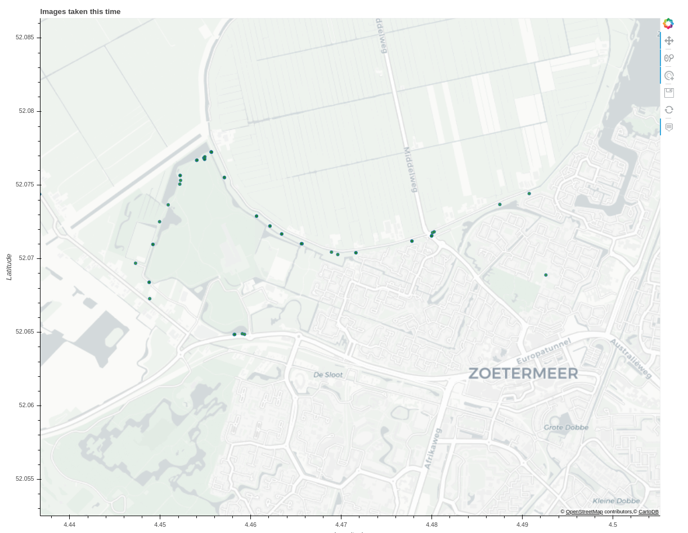

# geotag_images
Tool to add GPS data to images from a GPSlogger or Strava gps trace.
It can also generate an interactive map of the images taken (see example below).

## Prepare

First, install python3, then from the terminal:

- setup a virtual environment using: 
`python3 -m venv <name_of_virtualenv>`
- install dependencies: `pip install piexif timezonefinder pytz pyproj pandas bokeh`
- activate virtual environment: `source <name_of_virtualenv>/bin/activate`
- run the script (see below)
- deactivate the virtual environment using `deactivate`

The virtual environment only needs to be created once and can be used again when running the script again.

## Run:
`python main.py --input_location C:\for_example\image_folder --gpx_location C:\for_example\Strava_trace.gpx --gpx_source strava --correction '+00:01:00:00' --generate_map yes`

where:
- --input_location gives the directory containing the images
- --gpx_location gives the filepath to the gpx trace file (from strava or GPSlogger)
- --gpx_source gives the source of the gpx (strava or gpslogger)
- --correction gives the offset of the image timestamp as +DD:HH:MM:SS
- --generate_map creates a map showing locations where images were taken, clicking a point will open the respective image in the browser.

The correction is used if the camera time was incorrect and needs to be adjusted to match the images to the gps trace. 
The first character is + if the time needs to move forward and - if the time needs to move back, it will move the time as much as is 
given in the rest of the string. '+00:01:00:00' will move the time 1 hour forward for example.
'-03:02:15:23' would move the time 3 days, 2 hours, 15 minutes and 23 seconds back.
